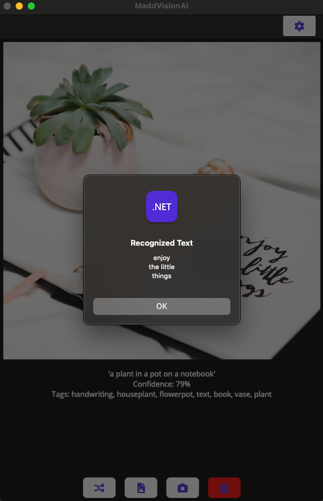

# Azure Vision AI Mobile Application

## Description

The following document outlines the structure and functionality of the Azure Vision AI app. The application is built using .NET Maui and targets Android, iOS, and macOS platforms. It utilizes Azure AI Services (Vision API) for image processing (text extraction and recognition). The application also integrates camera access, web image server access, and local image access as image sources. Additionally, I have integrated a cross-platform speech synthesizer to speak image descriptions, confidence levels, and image tags returned from Azure AI Vision. **The source code is located in the MaddVisionAI directory.**

## NuGet Packages

- `Azure.AI.Vision.ImageAnalysis`: Package for integrating with Azure AI Vision API.
- `PureWeen.Maui.FixesAndWorkarounds`: Package containing fixes and workarounds for .NET Maui.

## Application Features

### 1. Connection to Azure AI Service Vision API

- Integration with the Azure AI Service Vision API to process images from various sources.

### 2. Camera Access

- Access to the device's camera to capture images for processing with the Vision API.

### 3. Web Image Server Access

- Ability to fetch images from a web server (unsplash API) for processing with the Vision API.

### 4. Local Images Access

- Capability to select images stored locally on the device for processing with the Vision API.

### 5. Image Text Recognition

- Functionality to recognize and extract any text within images processed by the Vision API.

### 6. Cross-platform Speech Synthesizer

- Integration of a speech synthesizer to vocalize image descriptions, confidence levels, and image tags returned from Azure AI Vision.

## Text Recognition

- Text recognition is a feature that can be enabled/disabled in the settings page.
- When enabled, a button on the main UI indicates that text has been detected in the image.
- Pressing this button opens a dialog displaying the recognized text from the image.
- The recognized text is copied to the device clipboard for easy transfer to other applications.
- The button is disabled and has a different background color when an image with no recognized text is returned from Azure AI Vision.

## Settings Page

- The settings page provides the following features:
  - Display of the app name, version, and build number.
  - A button to open the platform-specific application settings for the app.
  - Switches to toggle the Text Recognition and Speech features.
  - Display of device information including manufacturer, model, version, platform, name, idiom, and device type.

